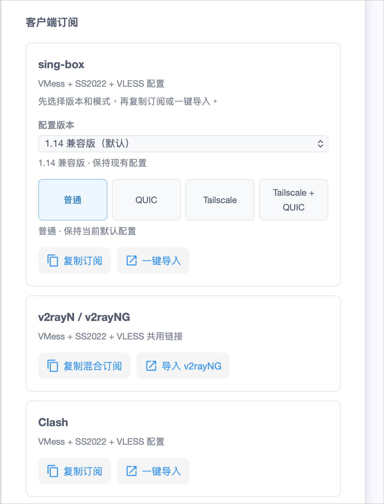
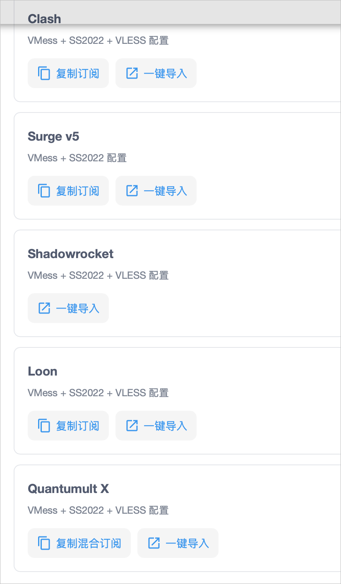
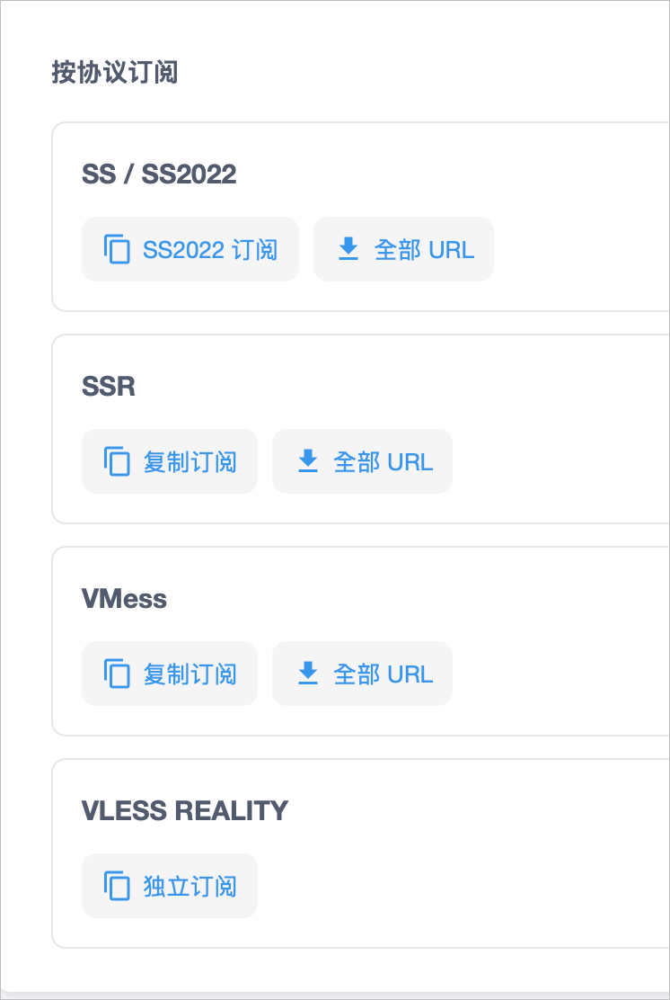

# 客户端订阅使用教程

本教程说明如何在面板的「客户端订阅」和「按协议订阅」区域获取订阅，并导入到常用客户端。

> **重要提示**
>
> - 订阅链接包含你的账号凭证，**不要发给他人**，也不要贴到公开群组或论坛。
> - 如果订阅链接泄露，请在面板中重置订阅链接，旧链接会失效。
> - 所有客户端导入后都需要 **更新订阅** 才能拉取节点；节点有变动时也要重新更新。
> - **一键导入** 需要在装有对应客户端的设备上打开面板点击（例如 iPhone 上的客户端，就要用 iPhone 的浏览器打开面板）。

---

## 一、怎么选客户端

| 你的设备 | 推荐客户端 | 使用面板里的哪个订阅 |
| --- | --- | --- |
| iPhone / iPad | Shadowrocket、sing-box、Quantumult X、Loon、Surge | 对应客户端名称的订阅 |
| Mac | sing-box、Surge、Clash Verge Rev | sing-box / Surge v5 / Clash |
| Android | sing-box（SFA）、v2rayNG、FlClash | sing-box / v2rayN / v2rayNG / Clash |
| Windows | v2rayN、Clash Verge Rev | v2rayN / v2rayNG / Clash |
| Linux 桌面 | Clash Verge Rev、sing-box | Clash / sing-box |

**订阅类型必须和客户端对应**，例如 Clash 订阅不能导入 v2rayN。各客户端的下载地址见 [二、客户端下载地址](#二客户端下载地址)。

各订阅包含的协议：

| 订阅 | VMess | SS2022 | VLESS |
| --- | :---: | :---: | :---: |
| sing-box | ✅ | ✅ | ✅ |
| v2rayN / v2rayNG | ✅ | ✅ | ✅ |
| Clash | ✅ | ✅ | ✅ |
| Surge v5 | ✅ | ✅ | ❌ |
| Shadowrocket | ✅ | ✅ | ✅ |
| Loon | ✅ | ✅ | ✅ |
| Quantumult X | ✅ | ✅ | ✅ |

> Surge 订阅不含 VLESS 节点，所以节点数量比其他客户端少，这是正常的。

---

## 二、客户端下载地址

> **请只从下面的官方地址下载。** 搜索引擎里有很多仿冒的“官网”，下载的安装包可能被篡改。

### iPhone / iPad / Mac（App Store）

| 客户端 | 下载地址 | 说明 |
| --- | --- | --- |
| sing-box | [App Store（sing-box VT）](https://apps.apple.com/app/sing-box-vt/id6673731168) | 免费；支持 iPhone、iPad、Mac、Apple TV |
| Shadowrocket | [App Store](https://apps.apple.com/app/shadowrocket/id932747118) | 付费；支持 iPhone、iPad、Apple 芯片 Mac |
| Quantumult X | [App Store](https://apps.apple.com/app/quantumult-x/id1443988620) | 付费 |
| Loon | [App Store](https://apps.apple.com/app/loon/id1373567447) | 付费 |
| Surge 5 | [App Store（iOS）](https://apps.apple.com/app/surge-5/id1442620678)、[官网（Mac 版）](https://nssurge.com/) | 功能需内购解锁，价格较高 |

> **中国大陆区 Apple ID 搜不到这些 App**，需要登录**非中国大陆区**（如美国、香港等）的 Apple ID 才能下载。
> 只在 App Store 里切换账号即可，**不要**在「设置 → iCloud」里登录别人的 Apple ID，以免设备被锁。

### Android

| 客户端 | 下载地址 |
| --- | --- |
| sing-box（SFA） | [Google Play](https://play.google.com/store/apps/details?id=io.nekohasekai.sfa)、[GitHub](https://github.com/SagerNet/sing-box/releases) |
| v2rayNG | [GitHub](https://github.com/2dust/v2rayNG/releases)（已从 Google Play 下架，只能从 GitHub 下载） |
| FlClash | [GitHub](https://github.com/chen08209/FlClash/releases) |
| Clash Meta for Android | [GitHub](https://github.com/MetaCubeX/ClashMetaForAndroid/releases) |

> GitHub 下载 APK 时，大多数手机选择文件名带 **`arm64-v8a`** 的版本；不确定就选带 **`universal`** 的版本。

### Windows / macOS / Linux

| 客户端 | 平台 | 下载地址 |
| --- | --- | --- |
| v2rayN | Windows（新版也支持 macOS / Linux） | [GitHub](https://github.com/2dust/v2rayN/releases) |
| Clash Verge Rev | Windows / macOS / Linux | [GitHub](https://github.com/clash-verge-rev/clash-verge-rev/releases) |
| sing-box | macOS / Linux / Windows | macOS 用 [App Store 版](https://apps.apple.com/app/sing-box-vt/id6673731168)；其他平台见 [GitHub](https://github.com/SagerNet/sing-box/releases) |

> 在 GitHub 的 Releases 页面，展开最新版本下方的 **Assets** 就能看到安装包。Windows 一般下载带 `windows-64` / `x64` 的文件，Apple 芯片 Mac 下载带 `arm64` / `aarch64` 的，Intel Mac 下载带 `x64` / `amd64` 的。

---

## 三、客户端订阅

### 1. sing-box（iOS / macOS / Android / 桌面）

#### 先在面板中选择配置

1. **配置版本**：在下拉框里选择与你客户端版本相符的配置。
   - 默认的「1.14 兼容版」适用于大多数用户。
   - 如果导入报错，先把客户端升级到最新版再试。
   - 在 sing-box 的 **设置（Settings）→ 关于** 中可以看到客户端版本号。App Store 版有时更新较慢，如果你的客户端版本低于 1.14，而下拉框里有更低版本的配置，请选择与客户端版本相符的那一项。
2. **模式**（QUIC / Tailscale 模式只有 sing-box 提供，其他客户端没有这个选项）：
   | 模式 | 说明 |
   | --- | --- |
   | 普通 | 默认配置，**不确定就选这个** |
   | QUIC | 使用 QUIC（基于 UDP）传输；如果你所在的网络限制 UDP，可能连不上，这时换回「普通」 |
   | Tailscale | 配置中加入 Tailscale 相关设置，只有需要 Tailscale 组网时才用 |
   | Tailscale + QUIC | 同时启用以上两项 |
3. 选好后，下方会显示当前选择，例如「普通 · 保持当前默认配置」。

> 每次切换版本或模式后，订阅链接都会变化，需要**重新复制或重新导入**。

#### 导入客户端

**方式 A：一键导入（推荐）**：点击 **「一键导入」**，浏览器会唤起 sing-box，确认添加即可。

**方式 B：手动添加**：

1. 点击 **「复制订阅」**。
2. 打开 sing-box → **Profiles（配置）** → **New Profile（新建）**。
3. Type 选择 **Remote（远程）**，名称随意填写，URL 粘贴刚才复制的链接。
4. 保存后回到 **Dashboard（仪表盘）**，选中该配置并启用。
5. 首次启用时系统会请求添加 VPN 配置，点击 **允许**。

### 2. v2rayN（Windows）/ v2rayNG（Android）

这个订阅是 **VMess + SS2022 + VLESS 共用链接**，两个客户端都能用。

#### v2rayNG（Android）

**一键导入**：在手机上点击 **「导入 v2rayNG」**，确认后进入 v2rayNG 右上角 **⋮** → **更新订阅**。

**手动添加**：

1. 点击 **「复制混合订阅」**。
2. 打开 v2rayNG → 左上角菜单 → **订阅分组设置** → 右上角 **＋**。
3. 备注随意填写，URL 粘贴订阅链接，保存。
4. 返回主界面 → 右上角 **⋮** → **更新订阅**。
5. 选择一个节点，点击右下角的 **V** 图标连接。

#### v2rayN（Windows）

1. 点击 **「复制混合订阅」**。
2. 打开 v2rayN → **订阅分组** → **订阅分组设置** → **添加**。
3. 备注随意填写，地址粘贴订阅链接，确定。
4. 回到主界面 → **订阅分组** → **更新全部订阅（不通过代理）**。
5. 选中节点后按 **Enter** 设为活动服务器，再在系统托盘把 **系统代理** 设为「自动配置系统代理」。

> 请使用较新版本的 v2rayN / v2rayNG，旧版本可能不支持 SS2022 或 VLESS 节点。

### 3. Clash

Clash 订阅包含 **SS2022 和 VLESS** 节点，**原版 Clash（已停更）不支持**，请使用 mihomo（Clash Meta）内核的客户端：

- Windows / macOS / Linux：**Clash Verge Rev**
- Android：**FlClash** 或 **Clash Meta for Android**

**一键导入**：点击 **「一键导入」**，浏览器会唤起 Clash 客户端，确认导入即可。

**手动添加（以 Clash Verge Rev 为例）**：

1. 点击 **「复制订阅」**。
2. 打开 Clash Verge Rev → **订阅**，在顶部输入框粘贴链接 → 点击 **导入**。
3. 点击导入后的订阅卡片使其生效。
4. 进入 **代理** 页选择节点，在 **设置** 中打开 **系统代理**（或 TUN 模式）。

### 4. Surge v5（iOS / macOS）

Surge 订阅只包含 **VMess + SS2022**（Surge 不支持 VLESS）。

**一键导入**：点击 **「一键导入」**，唤起 Surge 后确认安装配置。

**手动添加**：

1. 点击 **「复制订阅」**。
2. 打开 Surge → 配置列表 → **从 URL 下载配置**，粘贴链接并确认。
3. 选中该配置，回到首页启动。

### 5. Shadowrocket（小火箭，iOS）

Shadowrocket 只提供 **「一键导入」**：

1. 用 **iPhone / iPad 的 Safari** 登录面板。
2. 点击 **「一键导入」**，按提示打开 Shadowrocket，确认添加订阅。
3. 在 Shadowrocket 首页选择一个节点，打开顶部开关连接。
4. 以后更新：首页下拉，或在订阅上左滑选择 **更新**。

> 首次连接时系统会请求添加 VPN 配置，点击 **允许**。

### 6. Loon（iOS）

**一键导入**：点击 **「一键导入」**，唤起 Loon 后确认添加。

**手动添加**：

1. 点击 **「复制订阅」**。
2. 打开 Loon → **配置** → **订阅节点** → **＋**，粘贴链接并保存。
3. 回到首页选择节点，启动连接。

### 7. Quantumult X（iOS）

**一键导入**：点击 **「一键导入」**，唤起 Quantumult X 后确认添加。

**手动添加**：

1. 点击 **「复制混合订阅」**。
2. 打开 Quantumult X → 右下角 **风车图标** → **节点** → **引用（订阅）** → 右上角 **添加**。
3. 标签随意填写，资源路径粘贴链接，保存。
4. 回到首页长按节点区域选择节点，打开右上角开关连接。

---

## 四、按协议订阅（进阶）

「按协议订阅」只包含 **单一协议** 的节点，适合以下情况：

- 使用的客户端只支持某一种协议；
- 只想使用某一种协议的节点；
- 客户端无法识别上面的「客户端订阅」。

**一般用户直接用上面的「客户端订阅」就够了。**

| 协议 | 订阅按钮 | 用途 |
| --- | --- | --- |
| SS / SS2022 | SS2022 订阅 | 只含 SS2022 节点的订阅，适合只支持 Shadowsocks 的客户端 |
| SSR | 复制订阅 | 只含 SSR 节点，适合老的 SSR 客户端 |
| VMess | 复制订阅 | 只含 VMess 节点 |
| VLESS REALITY | 独立订阅 | 只含 VLESS REALITY 节点，客户端需要支持 REALITY（如较新版本的 v2rayN / v2rayNG / sing-box） |

点击对应的订阅按钮复制链接，在客户端中按「添加订阅」的方式导入，方法同上。

> 如果订阅无法使用，可以点击 **「全部 URL」**，然后回到客户端选择 **从剪贴板导入** 即可。

---

## 五、常见问题

**Q：一键导入没反应？**
A：说明设备上没有安装对应客户端，或浏览器拦截了唤起。先安装客户端；iOS 请用 Safari 打开面板；也可以改用「复制订阅」手动添加。

**Q：导入成功但没有节点 / 更新失败？**
A：
1. 确认账号没有过期、流量没有用完。
2. 确认订阅类型和客户端对应。
3. 更新订阅时选择「不通过代理」，或先关闭其他代理软件再更新。

**Q：Surge 的节点比别的客户端少？**
A：正常。Surge 不支持 VLESS，所以 Surge 订阅里没有 VLESS 节点。

**Q：有节点但连不上？**
A：
1. 检查设备时间是否准确（误差过大会导致 VMess 连接失败），开启自动同步时间。
2. sing-box 选了 QUIC 模式的，换回「普通」重试。
3. 换其他节点测试；仍然不行请提交工单，附上客户端名称、版本和报错截图。

**Q：订阅链接泄露了怎么办？**
A：在面板中重置订阅链接，然后在所有客户端中重新导入新链接。
